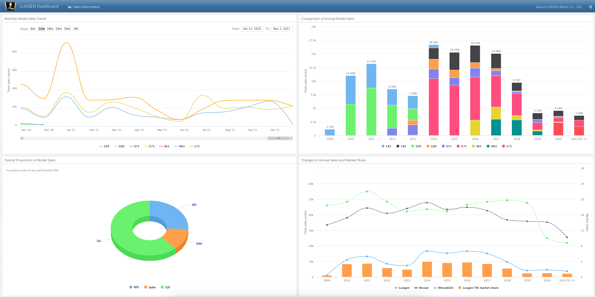

## Use R Markdown to publish a group of related data visualizations as a dashboard.

> Create the dashboard based on the historical monthly sales data of Taiwanese brand for LUXGEN Motors.

- **LUXGEN Automobile Sales Dashboard**:
